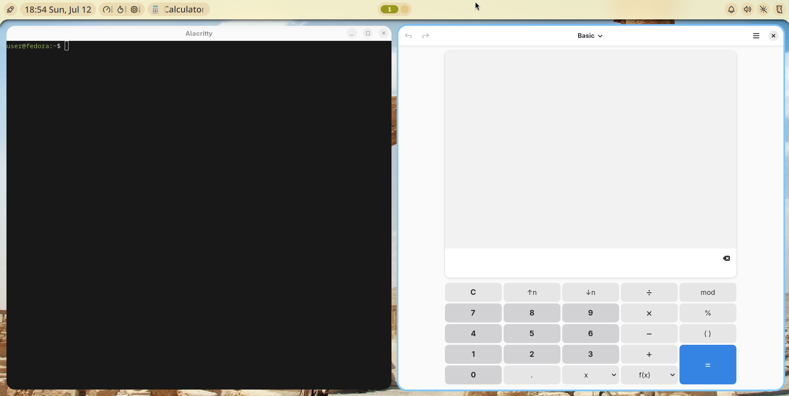

# Nuclear Drift 

An immutable desktop featuring the [Niri](https://niri-wm.github.io/niri/) compositor and [Noctalia](https://noctalia.dev) shell.
[You can build your own!](https://blue-build.org)



## Preview

To preview Nuclear Drift without touching bare metal, you can run it inside a virtual machine:

1. **Install Virtual Machine Manager (virt-manager)** on your host machine.
3. **Create a new virtual machine** using Fedora Silverblue (or any Fedora Atomic desktop).
4. **Complete the Fedora installation** inside the VM and log into the stock system once.
5. In the virtual machine settings, **enable 3D acceleration** and/or OpenGL. This is required for Niri.

Once you have a working Fedora Atomic VM, you're ready to rebase it to Nuclear Drift with the installation instructions below.

## Install

You can follow these installation steps on a VM or a physical machine; the only difference is where you installed Fedora Atomic.

1. **Install Fedora Silverblue** (or any Fedora Atomic desktop) by following the preview instructions above or <a href="https://docs.fedoraproject.org/en-US/atomic-desktops/installation/">hardware instructions</a>.

2. **Open a terminal and update the system** (optional but recommended)

   ```sh
   rpm-ostree upgrade
   sudo systemctl reboot
   ```

   This puts your base system on the latest update before you switch to Nuclear Drift.

3. **Validate access to the Nuclear Drift image**

   First, confirm that the image is reachable and readable from your machine:

   ```sh
   skopeo inspect --config docker://ghcr.io/lofidevops/nuclear-drift:latest
   ```

   - If this command succeeds, you know:
     - The image exists at that URL.
     - Your network and registry access to GitHub Container Registry are working.
   - If it fails, fix authentication or network issues before proceeding.

4. **Rebase from Silverblue to Nuclear Drift**

   In the same terminal:

   ```sh
   rpm-ostree rebase ostree-unverified-registry:ghcr.io/lofidevops/nuclear-drift:latest
   ```

   This tells Fedora's atomic system to:

   - Pull the Nuclear Drift image from `ghcr.io`.
   - Unpack it into an ostree deployment.
   - Set that deployment as the next root filesystem.

5. **Reboot into Nuclear Drift**

   Once the rebase completes:

   ```sh
   sudo systemctl reboot
   ```

   After the reboot, you should be running the Nuclear Drift image. Your login screen and desktop session should now be provided by Nuclear Drift instead of stock Silverblue.

## Update

To update your system:

```
rpm-ostree upgrade
sudo systemctl reboot
```

## Troubleshooting

If the rebase fails or you want to double‑check that the container image is valid, you can test it with Podman (or Docker):

```sh
podman pull ghcr.io/lofidevops/nuclear-drift:latest
# or docker pull ghcr.io/lofidevops/nuclear-drift:latest
```

This:

- Verifies that your machine can pull the **full image** from GitHub Container Registry.
- Confirms that the OCI image is structurally sound.

If `podman pull` or `docker pull` fails, fix that first. It usually means:

- Network problems,
- GHCR authentication issues, or
- A problem with the image itself.

Once `skopeo inspect` and `podman pull` both work, any remaining errors from `rpm-ostree rebase` are almost certainly in the rpm‑ostree/ostree tooling itself rather than access to Nuclear Drift.

## Technical notes

[](https://github.com/lofidevops/nuclear-drift/actions/workflows/build.yml)

**Base image:** `base-main` from [Universal Blue](https://universal-blue.org) (itself derived from Fedora's [Atomic Desktop](https://fedoraproject.org/atomic-desktops/) base image)

**Key packages:**
- [niri](https://niri-wm.github.io/niri/) — scrollable-tiling Wayland compositor
- [noctalia-shell](https://noctalia.dev) — desktop shell for Niri
- [greetd](https://sr.ht/~kennylevinsen/greetd/) + [tuigreet](https://github.com/apognu/tuigreet) — system login prompt

## Verification

> [!NOTE]
> Image signing is not yet enabled but is planned for a future release.

## Colophon

*Polymita sulphurosa* is a critically endangered Cuban snail.
